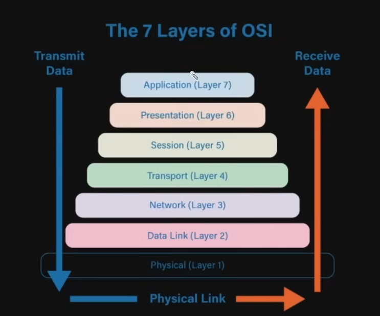
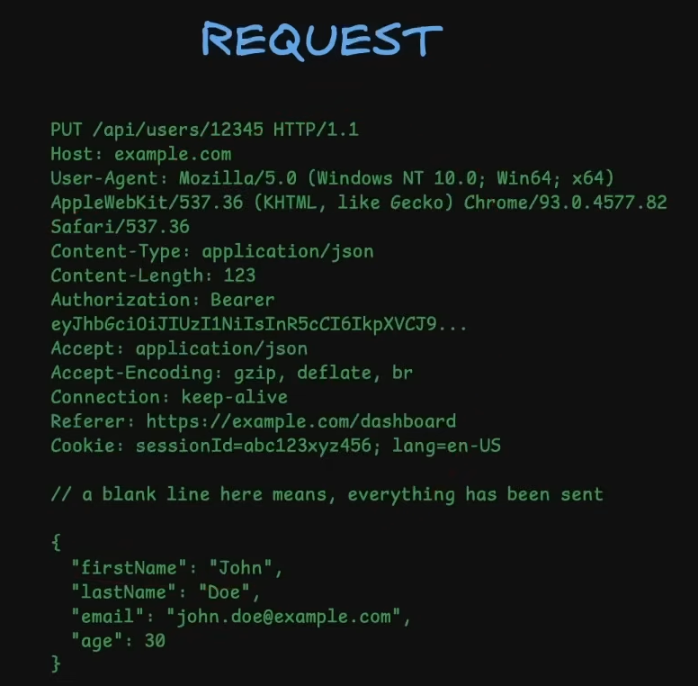
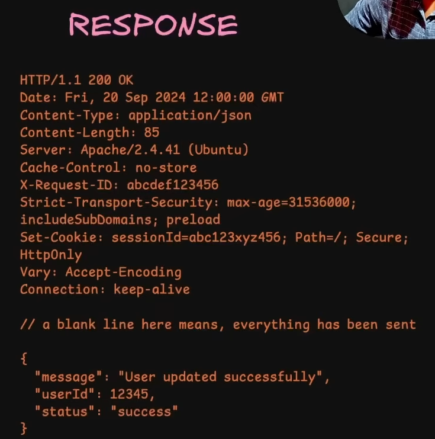

Reverse Proxy: A server that sits in front of other servers so that we can manage different types of redirects or configs from a centralized space, instead of changing the configs in every single server.

Request starts at the browser → goes to DNS → goes to the AWS server → goes through a firewall, then reaches the AWS instance → reaches NGINX → forwards request to local host (final server on the EC2 instance)

Backend is used for the need to fetch data, persist data, and respond with data

Why not do everything on the frontend?

- Frontend is fetched by the browser from our server and executed by the browser on the client's machine
- A browser is the runtime compared to a traditional backend, where we sent a request, the server did the processing, and sent us the response
- The actual processing happened on the server, while on the frontend, the processing happens on browser
- Browser runtimes are often sandbox environments, which means that they are isolated from our operating systems. Processes, filesystems, and everything are in an isolated environment, so the code can only access limited resources.

Why can’t we write backend logic in the frontend

1. Security reasons
    1. Backend needs to write files, access the filesystem, or access environment variables, and the browser won’t allow that
    2. cannot call external APIs unless we have appropriate CORS headers
    3. Databases
        1. Drivers are written to work in environments that can handle socket connections or binary data, or persistent connections, which browsers cannot handle
        2. The backend server maintains a list of connections called a connection pool to our DB server to avoid creating and destroying connections repeatedly.
    4. Computing power
        1. The user might not have enough computing power to carry out the business logic that the backend can easily do

CORS is a security policy of a browser that restricts JavaScript code from calling external APIs that are not a part of the current domain.

- We can only call APIs and fetch resource which are in the same domain

Power of learning backend from first principles

- Seeing the big picture
    - isolating things like backend, frontend, routes, middleware, db interaction, and so on
- Faster onboarding
- 10x faster in new projects
- Syntax fatigue
- Choosing the right tool for the right job

HTTP:

- Hyper text transfer protocol
- medium through which browser talks to the server, either to send data or to receive data from it

1. stateless
    1. it has no memory of past interactions
    2. Each request carries all the necessary information to carry out the operation
    3. After the server responds, it forgets about it
    4. self-contained requests
    5. benefits:
        1. simple architecture, no need to store information
        2. better scalability since it allows for easy distribution of requests across multiple servers
            1. Servers don’t need to store any information
2. Client server model
    1. client is typically a browser or app that initiates the conversation
        1. provides all information in the request, like URL, header, etc
        2. conversation is always initiated by the client
    2. server hosts resources and waits for incoming requests, processes, and sends back an appropriate response
    - client server needs to establish a connection for this request and response transfer. They use TCP for it. Transmission control protocol
        - TCP is more reliable and has a three-way handshake
            

            
    
    HTTP Messages
    
    - Request
        - 
            

            
    - 
- Response
    - 
        

        

HTTP Headers

- headers are key value pars of different parameters sent/received over a message/response
- why not send all info through the url?
- Request headers
    - sent by client to server in the request
    - user-agent
        - identifies what type of client (browser/postman/mobile app etc
    - authorization
        - sends credentials to identify the user
    - cookie
    - accept
        - what kind of content we are expecting in response
            - json. html etc

- General headers
    - some information like metadata
    - date
    - Cache-control
    - connection

Representation headers

- representation of the resource being transmitted or body of message
- content-type
- content-length
- content-encoding
- Etag
    - unique identifier for caching

Security headers

- Enhance security of request and response
- Strict transport security (HSTS)
- Content-security-policy (CSP)
- X-Framme-Options
- X-content-Type-Options
- Set-cookie

HTTP Methods

- Methods exist to represent different kinds of actions that a client can request on a server
- Methods define the intent of the interaction
- GET
    - fetch data from server not modify
- POST
    - to create some data in server
    - POST request has a body
- PATCH
    - update some data
    - has a request body
    - it is a selective replacement
- PUT
    - update data
    - different than patch because whatever info comes in has to completely replace the previous body
    - put is a complete replacement
- DELETE
    - delete some resource from the server
- OPTIONS
    - CORS flow (same origin policy)
    - fetch the capabilities of a server for a cross-origin request

Idempotent vs Non-idempotent

- Methods can be called multiple times, and we can expect the same kind of result
- GET,  PUT, and DELETE are idempotent
    - result will be the same
- POST is non-idempotent
    - Once we submit a request to create some data, and it goes through,
    - If we do it a second time, it creates a new instance
    - It produces different results for the same request