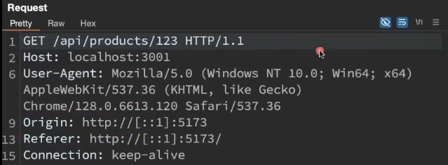
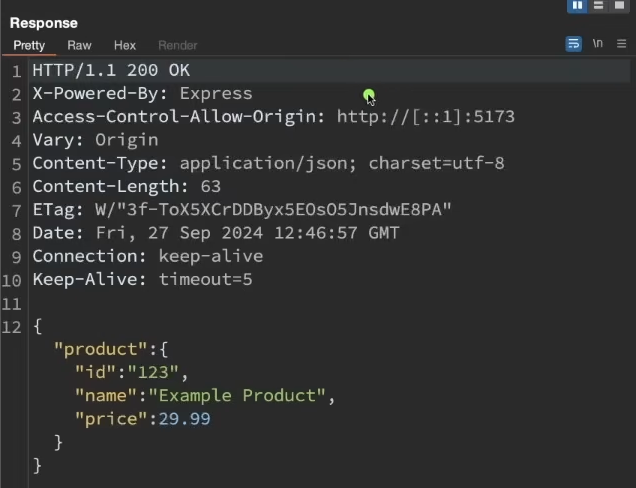
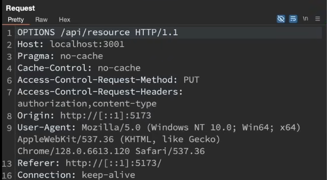
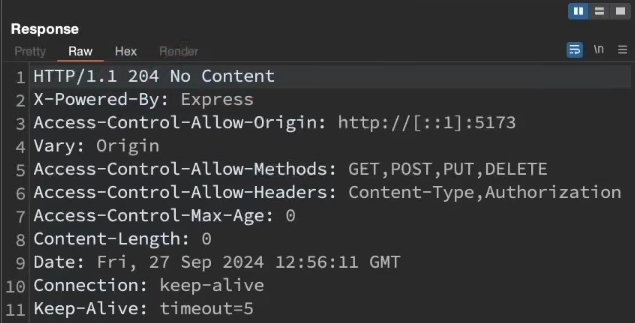
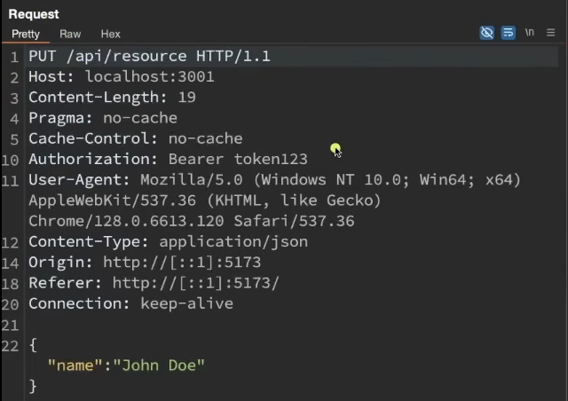
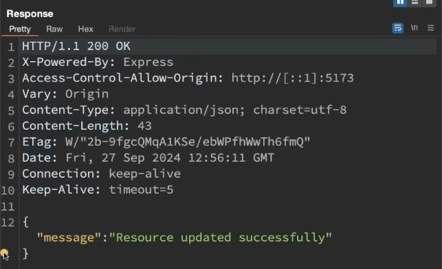

**CORS (Cross-Origin Resource Sharing)** is a browser security mechanism that controls how a frontend (e.g., `http://localhost:3000`) can access a backend on a different origin (e.g., `https://api.example.com`).

- Browser enforces the CORS, not the server

**CORS Simple request and response:**

CORS Request:

A cross origin request is a request where the host and the origin in the request are different. Origin is the frontend origin url and host is the domain port that we want to connect to which has the apis



CORS Response:

When a browser get the response it checks whether it has the Access-control-allow-origin header or not. Whether it has the appropriate port or the domain of the frontend or not. If it does the browser lets the response through and does not block it.



***What happens when we remove the Access-Control-Allow-Origin header for a simple request?***

- The browser blocks this response and shows a CORS error in the network tab

# CORS Simple Request Flow

## Definition

A **CORS simple request** is a cross-origin HTTP request that **does not trigger a preflight (OPTIONS) request**.

The browser sends the request directly to the server.

---

## Conditions for a Simple Request

A request is considered *simple* if all of the following are true:

### 1. Allowed HTTP Methods

- GET, HEAD, POST

### 2. Only Simple Headers Are Used

Allowed request headers:

- Accept, Accept-Language, Content-Language, Content-Type (restricted values only)

### 3. Allowed Content-Type Values (for POST)

- text/plain, application/x-www-form-urlencoded, multipart/form-data

If `Content-Type: application/json` → not simple → triggers preflight.

# CORS Preflighted Request Flow

## Definition

A **CORS preflighted request** is a cross-origin request where the browser sends an **OPTIONS request first** to check whether the actual request is allowed.

This happens before the original request.

---

## When Does a Preflight Happen?

A request is preflighted if ALL of the following are true:

### 1. It is a Cross-Origin Request

- The frontend origin and server origin are different.
- The protocol, domain, or port is different.

### 2. At Least One of These Conditions Is True

### The method is NOT:

- GET
- POST
- HEAD
    
    (e.g., PUT, DELETE, PATCH)
    

### The request includes non-simple headers:

- Authorization
- X-Custom-Header
- Any custom header

### The Content-Type is NOT:

- application/x-www-form-urlencoded
- multipart/form-data
- text/plain

Example:

```
Content-Type: application/json
```

→ Triggers preflight

# ✅ Example 1: Simple CORS Request Flow

### Scenario

Frontend: `http://localhost:3000`

Backend: `https://api.example.com`

Frontend makes a simple GET request:

```
fetch("https://api.example.com/users");
```

---

## Step 1 — Browser Sends the Request Directly

```
GET /users HTTP/1.1
Host: api.example.com
Origin: http://localhost:3000
```

No preflight request is sent.

---

## Step 2 — Server Responds

```
HTTP/1.1 200 OK
Access-Control-Allow-Origin: http://localhost:3000
Content-Type: application/json
```

---

## Step 3 — Browser Checks

- Origin matches → response is allowed
- JavaScript can read the data

Flow summary:

```
Browser → GET request → Server → Response → Browser checks header → Done
```

---

# 🚀 Example 2: Preflighted CORS Request Flow

### Scenario

Frontend: `http://localhost:3000`

Backend: `https://api.example.com`

Frontend sends a PUT request with an Authorization header:

```
fetch("https://api.example.com/users/1", {
  method: "PUT",
  headers: {
    "Content-Type": "application/json",
    "Authorization": "Bearer token"
  },
  body: JSON.stringify({ name: "Abhinav" })
});
```

This triggers a preflight because:

- Method is PUT
- Content-Type is application/json
- Authorization header is present

---

## Step 1 — Browser Sends Preflight (OPTIONS)

```
OPTIONS /users/1 HTTP/1.1
HOST: api.anotherdomain.com
Origin: http://localhost:3000
Access-Control-Request-Method: PUT
Access-Control-Request-Headers: Content-Type, Authorization
```

---

## Step 2 — Server Responds to Preflight

```
HTTP/1.1 204 No Content
Access-Control-Allow-Origin: http://localhost:3000 / * (A start here means it allows all type of clients to make request to this server)
Access-Control-Allow-Methods: PUT, DELETE (returns with what methods the server allows for the given resource)
Access-Control-Allow-Headers: Content-Type, Authorization
Access-Control-Max-Age: 86400 (These configs will be the same for atleast next 24 hours so don't keep making preflight request for every route)
```

---

## Step 3 — Browser Sends the Actual Request

```
PUT /users/1 HTTP/1.1
Origin: http://localhost:3000
Content-Type: application/json
Authorization: Bearer token
```

---

## Step 4 — Server Responds

```
HTTP/1.1 200 OK
Access-Control-Allow-Origin: http://localhost:3000
```

Browser checks the header → allows JavaScript to access the response.

Flow summary:

```
Browser → OPTIONS (preflight)
        → Server approves
        → PUT request
        → Server response
        → Browser checks header → Done
```

**CORS Preflight request and response:**

CORS Preflight Request:



The request is essentially asking 

- if PUT method is allowed or not
- if authorization / content-type headers are allowed or not

CORS Preflight Response:



The response basically says that it supports:

- GET, POST, PUT , DELETE
- Content-type and authorization headers

**Why did this following request trigger a preflight:**



1. It is a CORS request since host and origin are different
2. It is a PUT request not a simple request
3. It also has a authorization header
4. The content type is application/json

Response to the Actual Request

