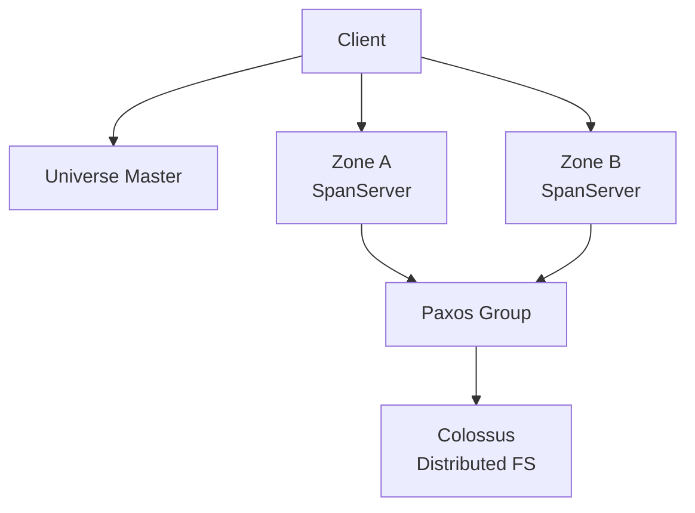

## Overview

Google Spanner is a globally distributed relational database that provides **external consistency** — a stronger guarantee than serialisability. It's the first system to distribute data globally while supporting general-purpose transactions and SQL queries.

## TrueTime API

The key innovation is TrueTime, a globally synchronised clock API that exposes clock uncertainty as a first-class concept.

| Method         | Returns                               |
| -------------- | ------------------------------------- |
| `TT.now()`     | `TTInterval [earliest, latest]`       |
| `TT.after(t)`  | true if `t` has definitely passed     |
| `TT.before(t)` | true if `t` has definitely not passed |

Spanner uses GPS receivers and atomic clocks in each data centre to keep uncertainty (ε) under **7ms** in practice.

## Commit Wait

To achieve external consistency, every read-write transaction waits until `TT.after(commit_timestamp)` is true before releasing locks. This guarantees that any transaction that starts after the commit will observe its effects.

```
commit_timestamp = TT.now().latest
wait until TT.after(commit_timestamp)
release locks
```

## Architecture



## Key Takeaways

- External consistency > serializability: a transaction that starts after another commits is guaranteed to see the newer state, even across data centres
- TrueTime makes bounded clock skew an engineering problem, not a theoretical assumption
- The 7ms commit wait is a real-world price paid for global consistency
