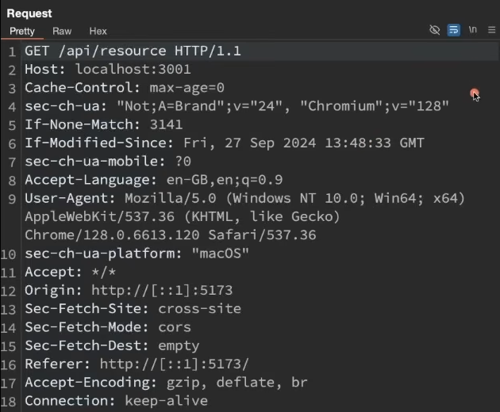
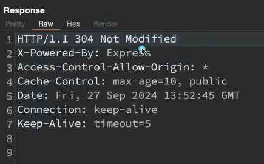
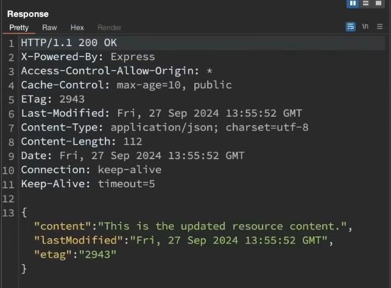
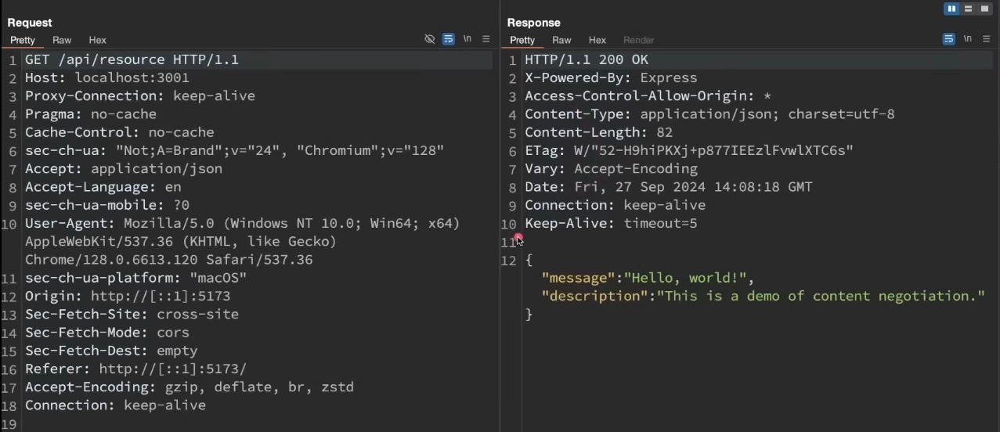
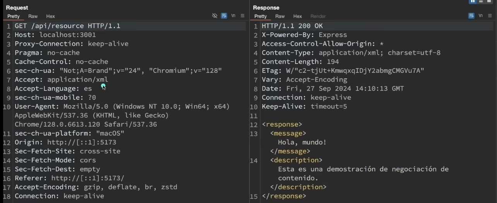
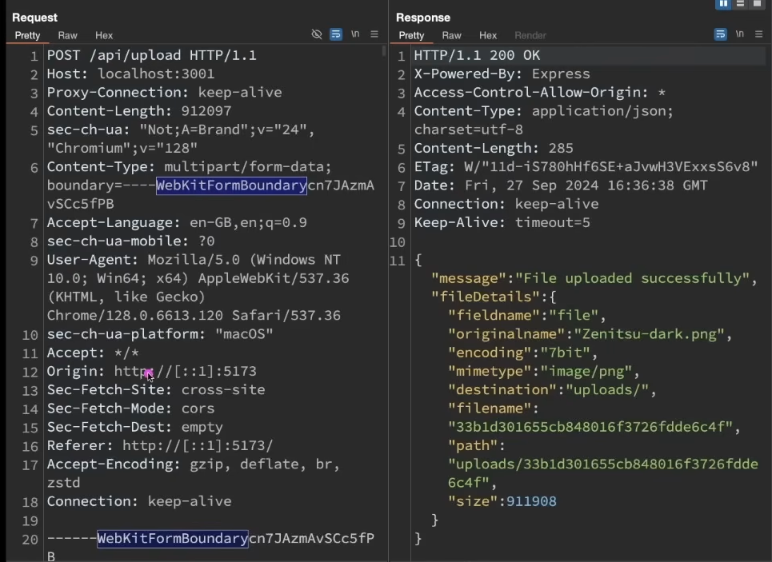
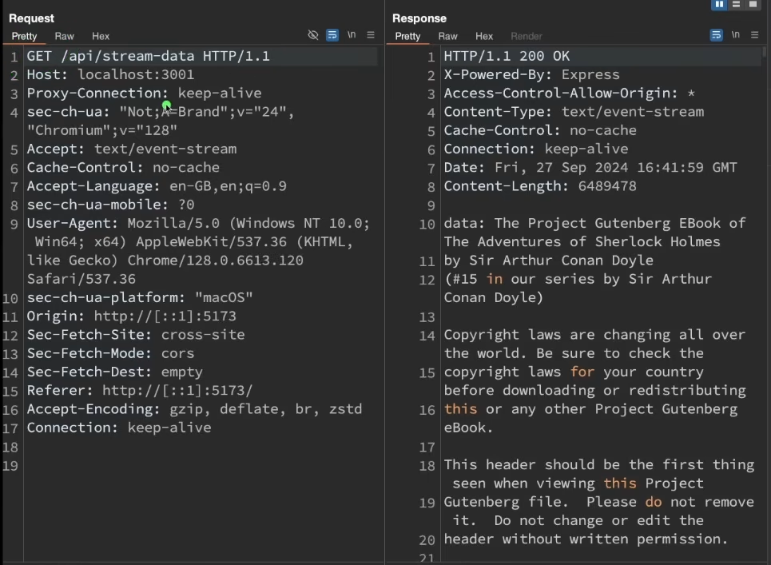

# HTTP Caching

- Technique to store copies of responses to reuse
- improves load time, reduces bandwidth, and reduces server load

Headers to consider in initial response:

Cache-Control:

- max-age=10
    - Use this for max of 10 seconds

ETag:

- essentially a hash that the server responds with

Last-Modified

- When was this resource last modified

Headers in request:

If-None-Match or If-Modified-Since, then send me the resource; otherwise, use my cached version

Response from server:

If the resource has been modified, we get the resource back

# **Content Negotiation**

- how clients and servers exchange information about different types, encoding, and representation of content
- Mechanism using which the client and server agree on the best server to exchange data

- Generally three types:
    - media types
        - Client specifies the desired format through the accept header, like JSON type, etc
        - 
    - language negotiation
        - Client requests content in a specific language using the Accept-language header, like English or spanish etc
    - encoding negotiation
        - The client specifies which encoding it supports using the Accept-encoding header like gzip, and the server responds with that compression format

Examples:

1. Language: English, format: JSON, encoding: gzip
    

    

1. Language: Spanish, format: XML, encoding: gzip
    

    

## HTTP-Based Compression

- Why do we use compression?
    - Significant increase in size if we do not use compression
    - Causes a lot of waste of bandwidth if the response size is very large
    - The server can send a compressed version, and the browser-side client can decompress it

# Persist connections and keep-alive

- In http1.0 each request-response cycle required a separate connection to server
- With persistent connections, a single TCP connection can be used for multiple requests and responses, avoiding the overhead of opening and closing a connection for every interaction
- For this, they introduced a header called “Keep-alive”
    - This enables persistent connections
    - Allows the client and server to reuse the same connection until one decides to close it
    - Connections stay alive until explicitly closed

# Handling Large Requests and Responses

## Multipart requests (Sending large data to the server)

- The data in the file is transferred from the client to the server in parts
    

    
- The “boundary” header acts as the delimiter to break down the binary data

## Streaming responses (Receiving Large responses from the server)

Main things to note:

- Content-Type: text/event-stream
- Connection: keep-alive (till the file is completely transferred, the server will keep sending data in chunks)

## SSL, TLS, and HTTPS

### SSL

- Original protocol for securing communications between a client and server
- encrypts data so that sensitive data cannot be intercepted
- Currently outdated

### TLS:

- Modern and more secure version of SSL
- Encrypts data in transit
- Uses certificates to authenticate the server and establish an encrypted connection, preventing eavesdropping and data breaches

### HTTPS:

- Basically HTTP, but more secure features are provided by SSL or TLS
- When you visit a website using HTTPS, TLS encrypts the communication between your browser and the server, which protects sensitive data