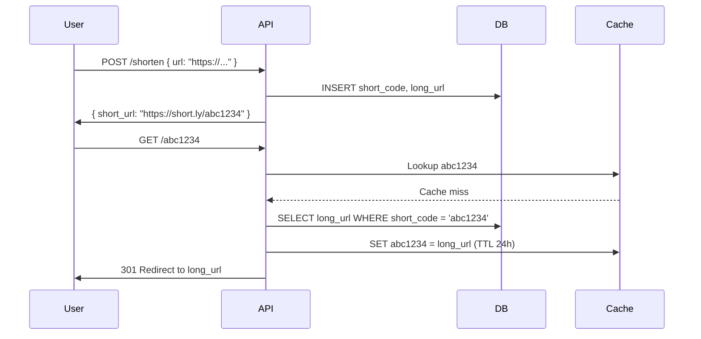

## Problem
Design a system that takes a long URL and returns a short alias (e.g. `bit.ly/xyz`). The system must redirect users from the short URL to the original one.

## Core Design

Use **Base62 encoding** (a-z, A-Z, 0-9) to generate a 7-character key, giving 62^7 ≈ 3.5 trillion possible URLs.

Two main approaches:
1. **Hash-based**: MD5 the long URL, take the first 7 characters. Risk of collisions.
2. **Counter-based**: Auto-increment an ID in the database, encode it in Base62. Guaranteed uniqueness.

## Database Schema

```sql
CREATE TABLE urls (
  short_code VARCHAR(10) PRIMARY KEY,
  long_url   TEXT NOT NULL,
  created_at TIMESTAMP DEFAULT NOW(),
  click_count INT DEFAULT 0
);
```

## Request Flow



## Scaling Considerations
- Cache hot URLs in **Redis** with LRU eviction — most traffic hits the same top ~20% of URLs
- Use a **301 redirect** (permanent) to offload repeat lookups to the browser cache; use **302** if you need accurate click analytics
- For very high write throughput, partition the counter across multiple nodes using a range-based ID allocator
